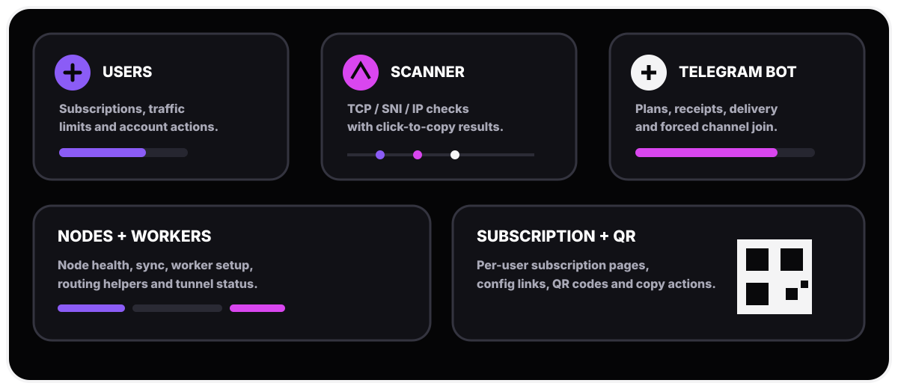
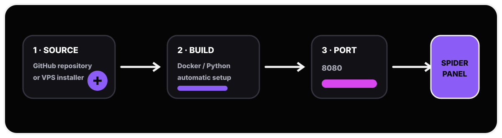
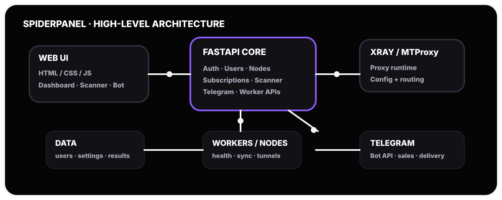
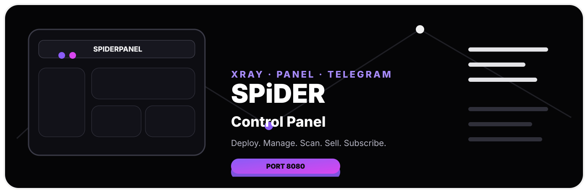

<div align="center">
  <p>
    <b>Shahi Panel — Modern Xray control panel for subscriptions, nodes, scanners and Telegram automation.</b><br>
    Forked from <a href="https://github.com/amirh00sain/SpiderPanel">SpiderPanel</a> by amirh00sain.
    Built around a responsive web UI with a fixed panel port <code>8080</code>.
  </p>

  <p>
    
    
    
  </p>
</div>

---

<details>
<summary><b>📚 Table of contents</b></summary>

- [Why SpiderPanel?](#-why-spiderpanel)
- [Deployment](#-deployment)
- [Public endpoint & subscription flow](#-public-endpoint--subscription-flow)
- [Telegram automation](#-telegram-automation)
- [Account, expiry & delivery behavior](#-account-expiry--delivery-behavior)
- [Scanner](#-scanner)
- [Nodes & workers](#-nodes--workers)
- [Project structure](#-project-structure)
- [Runtime & API](#-runtime--api)
- [UI details](#-ui-details)
- [Security notes](#-security-notes)
- [Development](#-development)
- [مستندات فارسی](#-مستندات-فارسی)

</details>

## ✦ Why SpiderPanel?

SpiderPanel brings the operational pieces of a proxy service into one panel: users, subscriptions, generated links, QR codes, nodes, workers, scanners, and Telegram automation.

It is designed to be useful both on a direct VPS installation and on container/deployer environments where the public hostname may not be known until runtime.

<div align="center">
  
</div>

### Core capabilities

| Area | What it provides |
|---|---|
| 👤 Users | Create/manage accounts, limits, traffic, links and per-user actions |
| 🔗 Subscriptions | Subscription pages, config links, QR codes and copy actions |
| 🛰 Nodes | Node management, health checks, refresh/sync operations |
| 🧪 Scanner | TCP / IP / SNI tooling, result lists and copy-friendly outputs |
| 🤖 Telegram Bot | Bot configuration, channel automation and sales workflows |
| 🛒 Sell Bot | Plans, receipts, manual approval and subscription delivery |
| 🟢 Expiry | Automatic expiration handling and cleanup of expired users |
| 🛠 Tools | Runtime info, workers, tunnel status and utility endpoints |

---

# 🚀 Deployment

<div align="center">
  
</div>

## Option A — One-command VPS install

Run the installer on a supported Linux VPS:

```bash
curl -fsSL https://raw.githubusercontent.com/amirh00sain/SpiderPanel/main/start.sh | bash
```

The project installer is intended to handle dependency setup, application files and runtime management. The panel itself is configured to listen on **port `8080`**.

### Useful installer variables

| Variable | Default | Purpose |
|---|---|---|
| `SPIDER_APP_DIR` | `/opt/SpiderPanel` | Application directory |
| `SPIDER_REPO` | `https://github.com/amirh00sain/SpiderPanel.git` | Git repository |
| `SPIDER_BRANCH` | `main` | Branch to deploy |
| `SPIDER_INSTALLER_URL` | project `start.sh` URL | Installer source |
| `SPIDER_UV_VERSION` | `0.12.9` | uv release used by installer |
| `SPIDER_XRAY_VERSION` | `26.3.27` | Xray release used by installer |

> Keep secrets out of the repository. Prefer environment variables or protected server configuration for any sensitive deployment data.

---

## Option B — Railway

1. Fork the repository into your GitHub account.
2. Create a new Railway project from the GitHub repository.
3. Let Railway build from the included `Dockerfile` / `railway.toml` configuration.
4. Expose the application on **port `8080`**.
5. Generate a public domain.
6. Open the generated domain and continue into the panel.

### Railway notes

- The application process listens on `0.0.0.0:8080`.
- `railway.toml` uses Uvicorn with the same fixed port.
- Public-domain discovery is important for subscription URLs and user-facing links.
- Avoid hard-coding `localhost` as a public subscription hostname.

---

# 🧭 Public endpoint & subscription flow

SpiderPanel contains runtime/public-endpoint helpers so the panel can work in environments where the final public hostname is assigned after deployment.

Typical user-facing flows include:

```text
Panel
  ├─ /spider                → main panel
  ├─ /login                 → login page
  ├─ /dashboard             → dashboard page
  ├─ /link/<uuid>           → user link view
  ├─ /p/<uuid_key>          → public subscription page
  └─ /api/sub/<uuid_key>    → subscription endpoint
```

The project also exposes QR endpoints for subscription/user configuration delivery.

---

# 🤖 Telegram automation

SpiderPanel includes Telegram-oriented workflows for administration, channel operations and sales.

### Channel Bot

The Channel Bot flow can create a new user, generate the subscription + QR, publish the generated content to the configured channel, and then perform the related cleanup step after successful delivery.

### Sell Bot

The customer-facing flow is intentionally simple:

```text
🟢 My Account   →   🛍 Products   →   💬 Support
```

Plans are managed independently and can carry their own name, price, inbound, traffic quota, duration and user prefix.

A typical purchase flow is:

```text
/start
   ↓
🛍 Products
   ↓
Select Plan
   ↓
Payment info
   ↓
Receipt upload
   ↓
Admin review
   ├─ ✅ Approve → Subscription + QR
   └─ ❌ Reject
```

The panel also supports forced channel membership checks, numeric Telegram admin IDs, plan management and expiration handling.

---

# 🛡 Account, expiry & delivery behavior

### Account identity

The Telegram sales flow associates a customer with a **Telegram Numeric User ID**. Existing accounts can be updated rather than blindly creating duplicates, while order activation is designed to avoid double-applying the same purchase.

### Expiration

When a user's configured expiration is reached, the expiry sweeper attempts to remove the account and clean its Telegram mapping, then reports the expiration to the user.

### Delivery safety

The project separates activation from delivery so a temporary Telegram delivery failure does not automatically mean the underlying account was duplicated or a previous account was incorrectly reported as removed.

---

# 🔎 Scanner

The scanner area includes tooling around:

- TCP / IP checks
- Cloudflare subnet data
- SNI lists and checks
- IP/SNI scan result handling
- batch ping operations
- fastest-result helpers

The mobile UI is tuned for compact, touch-friendly results so a domain or IP can be tapped and copied directly.

---

# 🌐 Nodes & workers

Node and worker tooling includes health checks, refresh/sync operations, worker setup and heartbeat/health helpers.

<div align="center">
  
</div>

At a high level:

```text
Web UI
  │
  ▼
FastAPI application
  ├── users / auth
  ├── subscriptions / QR
  ├── nodes / workers
  ├── scanner
  ├── Telegram bot
  └── runtime helpers
        │
        ├── Xray / proxy runtime
        └── application data
```

---

# 📁 Project structure

```text
.
├── data/
│   ├── cf_subnets.txt
│   ├── endpoint.txt
│   ├── sni-list.txt
│   ├── sni_reality.txt
│   └── sni_reality_for_scan.txt
├── static/
│   ├── index.html
│   ├── login.html
│   ├── sub.html
│   ├── spider-logo.svg
│   ├── img/
│   └── musix/
├── svg/                    # README / project SVG artwork
│   ├── logo.svg
│   ├── hero.svg
│   ├── features.svg
│   ├── deploy.svg
│   └── architecture.svg
├── worker/
│   ├── worker.js
│   ├── _worker.js
│   └── _worker.js.bak
├── Dockerfile
├── railway.toml
├── requirements.txt
├── start.sh
├── main.py
└── README.md
```

---

# ⚙️ Runtime & API

The backend is built with **FastAPI/Uvicorn**. The repository contains endpoints for authentication, users, subscriptions, nodes, scanners, workers, Telegram bot configuration and runtime information.

The Docker image exposes the panel on:

```text
0.0.0.0:8080
```

For a clean deployment, map your platform's public hostname to that application port.

---

# 🎨 UI details

SpiderPanel's interface is built around:

- responsive dark/light presentation
- compact touch interactions
- copy-friendly configuration actions
- collapsible sections where appropriate
- subscription pages with QR delivery
- Telegram glass-button style flows
- desktop + mobile layouts

The `svg/` directory contains the original documentation artwork used by this README. They are intentionally standalone SVG files so the repository can keep its visual identity without relying on raster screenshots.

---

# 🔐 Security notes

- Never commit Telegram bot tokens, passwords, API keys or private deployment credentials.
- Put sensitive values into protected environment/server configuration.
- Use HTTPS for production panel access.
- Restrict administrative access to trusted operators.
- Review generated subscription links before sharing them publicly.

---

# 🧑‍💻 Development

For local experimentation, install the Python dependencies and run the FastAPI application with Uvicorn:

```bash
python -m venv .venv
source .venv/bin/activate
pip install -r requirements.txt
python -m uvicorn main:app --host 0.0.0.0 --port 8080
```

Then open:

```text
http://127.0.0.1:8080/spider
```

For production or public subscriptions, use the real public hostname rather than `127.0.0.1` / `localhost` in user-facing links.

---

# 💬 Links

- GitHub: https://github.com/amirh00sain/SpiderPanel
- Installer: https://raw.githubusercontent.com/amirh00sain/SpiderPanel/main/start.sh
- Telegram: https://t.me/amirspl1der
- Channel: https://t.me/SPiDER_VPN1

---

<div align="center">
  

  <h3>SPiDER PANEL</h3>
  <p><i>Deploy fast. Manage cleanly. Keep every configuration within reach.</i></p>
</div>

---

# 🇮🇷 مستندات فارسی

<div dir="rtl">

## ✦ SpiderPanel چیست؟

**SpiderPanel** یک پنل مدیریتی برای مدیریت کاربران، اشتراک‌ها، کانفیگ‌ها، نودها، اسکنرها و اتوماسیون تلگرام است. رابط کاربری برای دسکتاپ و موبایل طراحی شده و پورت اصلی پنل روی **8080** ثابت است.

<div align="center" dir="ltr">
  
</div>

### امکانات اصلی

| بخش | توضیحات |
|---|---|
| 👤 کاربران | ساخت و مدیریت کاربر، حجم، محدودیت، لینک و عملیات حساب |
| 🔗 اشتراک | صفحه اشتراک، لینک کانفیگ، QR Code و کپی سریع |
| 🛰 نودها | مدیریت نود، سلامت، Refresh و Sync |
| 🧪 Scanner | بررسی TCP، IP، SNI و نتایج قابل کپی |
| 🤖 Telegram Bot | مدیریت Bot، کانال و فرایندهای فروش |
| 🛒 Sell Bot | پلن، رسید، تأیید دستی و تحویل Subscription |
| 🟢 انقضا | حذف/پاک‌سازی حساب‌های منقضی و اطلاع‌رسانی |
| 🛠 ابزارها | Worker، Tunnel، Runtime و ابزارهای کمکی |

---

## 🚀 نصب روی VPS

روی VPS لینوکسی دستور زیر را اجرا کنید:

```bash
curl -fsSL https://raw.githubusercontent.com/amirh00sain/SpiderPanel/main/start.sh | bash
```

پورت پنل:

```text
8080
```

### متغیرهای مفید نصب

| متغیر | مقدار پیش‌فرض | کاربرد |
|---|---|---|
| `SPIDER_APP_DIR` | `/opt/SpiderPanel` | مسیر نصب |
| `SPIDER_REPO` | مخزن SpiderPanel | مخزن پروژه |
| `SPIDER_BRANCH` | `main` | شاخه نصب |
| `SPIDER_INSTALLER_URL` | آدرس `start.sh` پروژه | منبع Installer |
| `SPIDER_UV_VERSION` | `0.12.9` | نسخه uv |
| `SPIDER_XRAY_VERSION` | `26.3.27` | نسخه Xray |

---

## 🚂 نصب روی Railway

1. Repository را در GitHub Fork کنید.
2. در Railway یک پروژه از GitHub بسازید.
3. پروژه را Deploy کنید تا `Dockerfile` و `railway.toml` استفاده شوند.
4. پورت **8080** را برای سرویس قرار دهید.
5. یک Domain عمومی بسازید.
6. با Domain ساخته‌شده وارد پنل شوید.

> برای لینک Subscription از `localhost` استفاده نکنید؛ لینک عمومی باید با Domain واقعی سرویس ساخته شود.

<div align="center" dir="ltr">
  
</div>

---

## 🤖 Telegram Bot و فروش

روند ساده کاربر:

```text
🟢 اعتبار من   ·   🛍 محصولات   ·   💬 پشتیبانی
```

جریان خرید:

```text
/start
  ↓
🛍 محصولات
  ↓
انتخاب Plan
  ↓
اطلاعات پرداخت
  ↓
ارسال رسید
  ↓
تأیید ادمین
  ├─ ✅ تأیید → Subscription + QR
  └─ ❌ رد
```

ادمین فروش با **Numeric Telegram User ID** مشخص می‌شود و مدیریت Planها و سفارش‌های معلق از داخل پنل/بات انجام می‌شود.

عضویت اجباری در کانال نیز قابل تنظیم است و پیش از ورود کاربر به بخش‌های فروش می‌تواند بررسی شود.

---

## 🟢 اعتبار و انقضا

در بخش اعتبار، اطلاعات حساب خریدار مانند شناسه عددی تلگرام، وضعیت، حجم، تاریخ انقضا و لینک Subscription قابل نمایش است.

وقتی زمان اعتبار تمام شود، سیستم expiry sweeper برای حذف حساب و پاک‌سازی mapping تلاش می‌کند و کاربر را از پایان اعتبار مطلع می‌کند.

---

## 🔎 Scanner

در بخش Scanner ابزارهای زیر قرار دارند:

- TCP / IP
- SNI
- Cloudflare subnet
- Ping batch
- Scan result handling
- نمایش نتایج با قابلیت کپی مستقیم روی موبایل

نتیجه‌های TCP در حالت موبایل فشرده شده‌اند تا IP و دامنه به‌راحتی لمس و کپی شوند.

---

## 🌐 Node / Worker

ابزارهای Node و Worker برای Health Check، Refresh، Sync، Setup و Heartbeat در پنل قرار دارند.

<div align="center" dir="ltr">
  
</div>

ساختار کلی:

```text
Web UI
  ↓
FastAPI
  ├─ Users / Auth
  ├─ Subscription / QR
  ├─ Nodes / Workers
  ├─ Scanner
  ├─ Telegram
  └─ Runtime helpers
```

---

## 📁 ساختار پروژه

```text
.
├── data/
├── static/
├── svg/                 # SVG های README و هویت بصری پروژه
├── worker/
├── Dockerfile
├── railway.toml
├── requirements.txt
├── start.sh
├── main.py
└── README.md
```

---

## ⚙️ اجرای محلی

```bash
python -m venv .venv
source .venv/bin/activate
pip install -r requirements.txt
python -m uvicorn main:app --host 0.0.0.0 --port 8080
```

سپس:

```text
http://127.0.0.1:8080/spider
```

برای لینک‌های عمومی و Subscription از Domain واقعی استفاده کنید، نه `localhost`.

---

## 🔐 نکات امنیتی

- Token، Password، API Key و اطلاعات حساس را داخل Git Commit نکنید.
- مقادیر حساس را در Environment یا تنظیمات محافظت‌شده نگهداری کنید.
- پنل عمومی را با HTTPS اجرا کنید.
- دسترسی ادمین را محدود نگه دارید.
- لینک Subscription را قبل از انتشار عمومی بررسی کنید.

---

## 🔗 لینک‌ها

- GitHub: https://github.com/amirh00sain/SpiderPanel
- Installer: https://raw.githubusercontent.com/amirh00sain/SpiderPanel/main/start.sh
- Telegram: https://t.me/amirspl1der
- Channel: https://t.me/SPiDER_VPN1

</div>

<div align="center">
  
</div>
